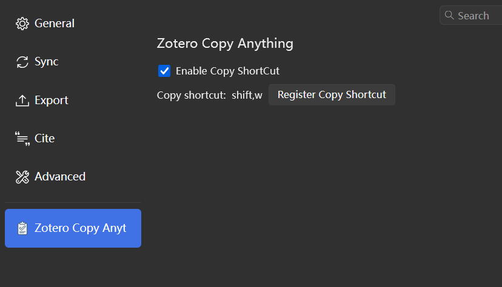
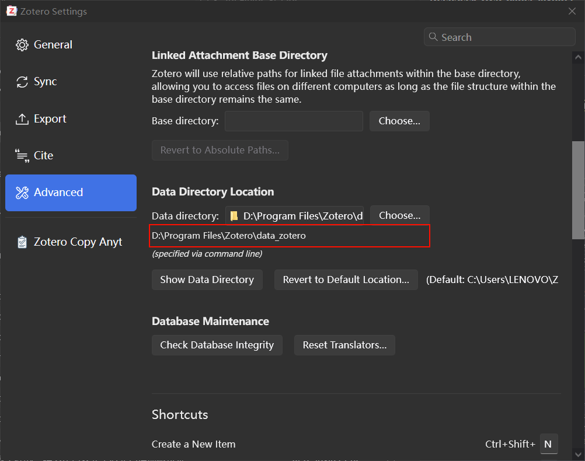

  

# Zotero Copy Anything

# Download

- [github](https://github.com/windfollowingheart/zotero-copy-anything/releases/download/v1.0.4/zotero-copy-anything.xpi)
- [gitee](https://gitee.com/windheartyolo/zotero-copy-anything/releases/download/v1.0.4/zotero-copy-anything.xpi)

# How to use?

## Copy item attachment to clipboard.

  
  

CTRL+V can paste the attachment to the clipboard.

  

If the item is not synchronized to the local, it cannot be copied.

  

## Register the copy shortcut.

Click the "Register Copy Shortcut" button, and then press the shortcut key combination you want to use.

This shortcut can only copy selected items.

  

## Download Binary File.

The plugin requires binary files to run, which need to be downloaded from the internet. If the download fails, you can also manually download and place them in the specified directory. Then restart Zotero.

### Get the specified directory

`{ZOTERO_DATA_DIR}/storage/zotero-copy-anything`
`ZOTERO_DATA_DIR` can be obtained as follows:

  

if the directory: `zotero-copy-anything` does not exist, create it.

### Binary file download links

- Windows: [windows](https://gitee.com/windheartyolo/zotero-copy-anything/releases/download/binary/copyfiles.exe)
- MacOS: [macos](https://gitee.com/windheartyolo/zotero-copy-anything/releases/download/binary/copyfiles-mac)
- Linux: [linux](https://gitee.com/windheartyolo/zotero-copy-anything/releases/download/binary/copyfiles-linux)

# Support Platform

- Windows
- MacOS
- Linux

## Linux

need to install `xclip` and `wl-clipboard`

# Features

- Copy item attachment to clipboard.
- Support multiple attachments copy.
- Support multiple attachment formats.

# Thanks

- [Zotero Plugin Template](https://github.com/windingwind/zotero-plugin-template)

---
