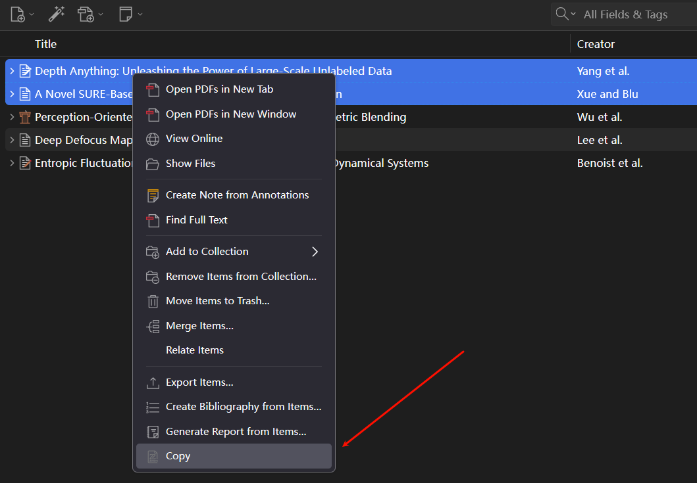
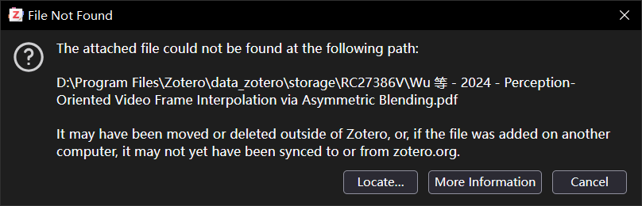

  

# Zotero Copy Anything

# Download

- [Zotero Copy Anything](https://gitee.com/windheartyolo/zotero-copy-anything/releases/download/v1.0.0/zotero-copy-anything.xpi)

# How to use?

  

CTRL+V 可直接粘贴到浏览器

  

如果文献没有同步到本地，无法复制

  

# Support Platform

- Windows
- MacOS
- Linux

## Linux

need to install `xclip` and `wl-clipboard`

# Features

- Copy item attachment to clipboard.
- Support multiple attachments copy.

# Thanks

- [Zotero Plugin Template](https://github.com/windingwind/zotero-plugin-template)

---
