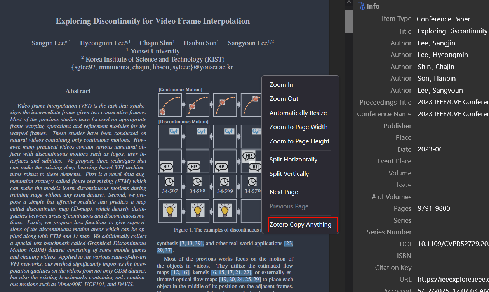

  

# Zotero Copy Anything

# Download

- [github](https://github.com/windfollowingheart/zotero-copy-anything/releases/download/v1.0.0/zotero-copy-anything.xpi)
- [gitee](https://gitee.com/windheartyolo/zotero-copy-anything/releases/download/v1.0.0/zotero-copy-anything.xpi)

# How to use?

  
  

CTRL+V can paste the attachment to the clipboard.

  

If the item is not synchronized to the local, it cannot be copied.

  

# Support Platform

- Windows
- MacOS
- Linux

## Linux

need to install `xclip` and `wl-clipboard`

# Features

- Copy item attachment to clipboard.
- Support multiple attachments copy.
- Support multiple attachment formats.

# Thanks

- [Zotero Plugin Template](https://github.com/windingwind/zotero-plugin-template)

---
